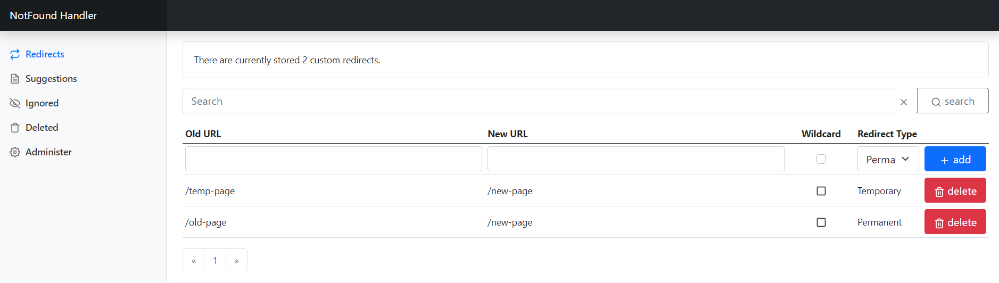

# NotFound Handler for ASP.NET Core and Optimizely

## Status


## Description

|Build|Code Analysis|.NET|CMS|
|-----|-------------|----|---|
|,branch:master/statusIcon) | [](https://sonarcloud.io/summary/new_code?id=Geta_geta-notfoundhandler) | [](https://docs.microsoft.com/en-us/dotnet/) | [](http://world.episerver.com/cms/) |

The popular NotFound handler for ASP.NET Core and Optimizely, enabling better control over your 404 page in addition to allowing redirects for old URLs that no longer works.

The perfect companion if you're transitioning to your site from another system and cannot keep the URL structure, or plan to do major re-structuring of your content.



## Features

* The NotFound handler stores the redirects in the database. Editors can add redirects without any deployments.
* All redirects are edited in the Admin UI as shown above. After the add-on is installed and a proper 404 page has been created, no changes to the application is needed to add new redirects.
* You can import and export redirects as XML from the Admin UI.
* Handles partial and "full" URLs and can redirect out of the site by using fully qualified URLs for the "New url" field.
* Supports wildcard redirects.
* By using fully qualified URLs in the "Old url" field, they will only apply for that specific site. Editing redirects is done for all sites in the same UI.

# Installation

The command below will install Admin UI and NotFound handler into your ASP.NET Core project.

```
Install-Package Geta.NotFoundHandler.Admin
```

If you need only the handler, then you can install it by the command below.

```
Install-Package Geta.NotFoundHandler
```

For the Optimizely project, you would want to install Admin UI integration package.

```
Install-Package Geta.NotFoundHandler.Optimizely
```

The package can be found in the [Optimizely Nuget Feed](https://nuget.episerver.com/package/?id=Geta.NotFoundHandler).

# Configuration

Add the NotFound handler in the Startup.cs in the `ConfigureServices` method. Below is an example with all available configuration you can set.
For Optimizely project, also call `AddOptimizelyNotFoundHandler` - it will add Admin UI in the Optimizely admin UI.

```
public void ConfigureServices(IServiceCollection services)
{
    var connectionString = ... // Retrieve connection string here
    services.AddNotFoundHandler(o =>
    {
        o.UseSqlServer(connectionstring);
        o.BufferSize = 30;
        o.ThreshHold = 5;
        o.HandlerMode = FileNotFoundMode.On;
        o.IgnoredResourceExtensions = new[] { "jpg", "gif", "png", "css", "js", "ico", "swf", "woff" };
        o.Logging = LoggerMode.On;
        o.LogWithHostname = false;
        o.AddProvider<NullNotFoundHandlerProvider>();
    });

services.AddOptimizelyNotFoundHandler();

...
}
```

The first and the mandatory configuration is a connection string. Use `UseSqlServer` method to set up the database connection string.

In addition, the configuration can be read from the `appsettings.json`:

```
"Geta": {
    "NotFoundHandler": {
        "BufferSize":  40
    }
}
```

The configuration from the `appsettings.json` will override any configuration set in the Startup. Note that you cannot provide a connection string or add providers in the `appsetings.json`. All other settings are supported.

Next, initialize NotFound handler in the `Configure` method as the first registration. It will make sure that NotFound handler will catch all 404 errors.
For Optimizely project, also call `UseOptimizelyNotFoundHandler`. This will make sure that any updates are synchronized between servers (on DXP, for example).

```
public void Configure(IApplicationBuilder app)
{
    app.UseNotFoundHandler();
    app.UseOptimizelyNotFoundHandler();
...
}
```

Also, you have to add Razor pages routing support.

```
app.UseEndpoints(endpoints =>
{
    endpoints.MapRazorPages();
});
```

## Settings

**HandlerMode** You can turn off the redirects by setting `HandlerMode` to `Off`. Default is `On`.

### Logging
Suggestions for NotFound rules require 404 requests to be logged to the database.

Logging of 404 requests is buffered to shield your application from Denial of Service attacks. By default, logging will happen for every 30'th error. You can change this setting in the configuration and set `bufferSize` to `0` to log the errors immediately. This is not recommended as you will be vulnerable to massive logging to your database. You can control how much you would like to log by specifying a threshold value. This value determines how frequently 404 errors are allowed to be logged.

**Important!** Even if the threshold is set low, you can still receive a lot of requests in the 404 log. In the Admin view (follow "Administer" link in gadget) you can delete suggestions (logged 404 requests). You can find all the logged items in the `NotFoundHandler.Suggestions` table in your database if you want to manually clear the logged requests (this will not remove any redirects).


**Logging**: Turn logging `On` or `Off`. Default is `On`

**BufferSize**: Size of memory buffer to hold 404 requests. Default is 30

**Threshold**: Average maximum allowed requests per second. Default is 5

 * Example 1:
   * bufferSize is set to 100, threshold is set to 10
   * Case: 100 errors in 5 seconds - (diff = seconds between first logged request and the last logged request in the buffer).
   * 100 / 5 = 20. Error frequency is higher than threshold value. Buffered requests will not get logged, the entire buffer will be discarded.
 * Example 2:
   * bufferSize is 100, threshold is 10
   * Case: 100 errors in 15 seconds
   * 100 / 15 = 6. Error frequency is within threshold value. Buffered requests will get logged.

If the `bufferSize` is set to `0`, the `threshold` value will be ignored, and every request will be logged immediately.

**LogWithHostname**: Set to `true` to include hostname in the log. Useful in a multisite environment with several hostnames/domains. Default is `false`

### Specifying ignored resources

**IgnoredResourceExtensions**

By default, requests to files with the following extensions will be ignored by the redirect module: `jpg,gif,png,css,js,ico,swf,woff`

If you want to specify this yourself, add `IgnoredResourceExtensions` to the configuration.

## Restricting access to the Admin UI

By default, only users of `Administrators` role can access Admin UI. But you can configure you authorization policy when registrating the NotFound handler.

```
 services.AddNotFoundHandler(o => { },
            policy =>
            {
                policy.RequireRole("MyRole");
            });
```

You can setup any policy rules you want.

## Import

For details see [Import redirects for 404 handler](https://getadigital.com/blog/import-redirects-for-404-handler/) article.

# Custom 404 Page

To setup 404 page, you can use any method ASP.NET Core provides.

One of the simplest solutions is adding a controller and a view for it that would display an error page:

```
[Route("error")]
public class ErrorController : Controller
{
    [Route("404")]
    public IActionResult PageNotFound()
    {
        return View();
    }
}
```

Then register status code pages in the Startup's `Configure` method before NotFound handler registration:

```
public void Configure(IApplicationBuilder app, IWebHostEnvironment env)
{
    app.UseStatusCodePagesWithReExecute("/error/{0}");
    app.UseNotFoundHandler();

...
}
```

Registering before the NotFound handler will make sure that a NotFound handler already checked the error and only those errors that were not handled by NotFound handler will be redirected to the error page.

# Custom Handlers
If you need more advanced or custom logic to create redirects, you can implement an INotFoundHandler.

1. Create a class that implements `Geta.NotFoundHandler.Core`
2. In the `public string RewriteUrl(string url)` method, add your custom logic
3. Register the handler in the configuration.

```
services.AddNotFoundHandler(o =>
{
        o.AddProvider<CustomProductRedirectHandler>();
});
```

This is especially useful for rewrites that follow some kind of logic, like checking the querystring for and id or some other value you can use to look up the page.

Here is an example using Optimizely Find to look up a product by code:

```csharp
public class CustomProductRedirectHandler : INotFoundHandler
{
    public string RewriteUrl(string url)
    {
        if(url.Contains("productid"))
        {
            // Give it a thorough look - see if we can redirect it
            Url uri = new Url(url);
            var productId = uri.QueryCollection.GetValues("productid").FirstOrDefault();
            if (productId != null && string.IsNullOrEmpty(productId) == false)
            {
                SearchResults<FindProduct> results = SearchClient.Instance.Search<FindProduct>()
                    .Filter(p => p.Code.MatchCaseInsensitive(productId))
                    .GetResult();
                if (results.Hits.Any())
                {
                    // Pick the first one
                    SearchHit<FindProduct> product = results.Hits.FirstOrDefault();
                    return product.Document.ProductUrl;
                }
            }
        }
        return null;
    }
}
```

**Note!** Make sure the code you add has good performance, it could be called a lot. If you're querying a database or a search index, you might want to add caching and perhaps Denial Of Service prevention measures.

# Troubleshooting
The module has extensive logging. Turn on debug logging for the `Geta.NotFoundHandler` namespace in your logging configuration.

# Usage

## Wildcards

If you want to redirect many addresses below a specific one to one new URL, set this to true. If we get a wild card match on this URL, the new URL will be used in its raw format and the old URL will not be appended to the new one.

For example, if we have a redirect: `/a` to `/b`, then:
- with wildcard setting it will redirect `/a/1` to `/b`
- without wildcard setting it will redirect `/a/1` to `/b/1`

# Sandbox App
Sandbox application is testing poligon for pacakge new features and bug fixes.

CMS username: admin@example.com

Password: Episerver123!

# Contributing
If you can help please do so by contributing to the package!
Reach out package maintainer for additional details if needed.

## Package Maintainer

https://github.com/marisks


# Mentions and Resources


